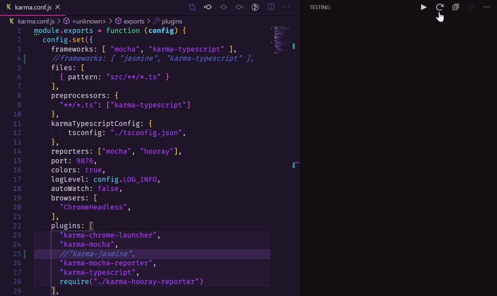

# Karma Mocha Example

This repository is a test project intended to be used for debugging [Angular/Karma Test Explorer](https://github.com/Raagh/angular-karma_test-explorer). This extension works well with Jasmine tests, but fails to load Mocha tests as used in this project.

## Run the project

1. Restore dependencies using `npm ci`
2. Run the Karma tests using `npm run test`
3. Run the Mocha tests using `npm run test:mocha`

## Switch between Mocha and Jasmine tests

The Karma configuration defaults to using Mocha tests. To switch from Mocha to Jasmine as test framework make the following adjustments inside the `karma.conf.js` file:

Change

```javascript
config.set({
    ...
    frameworks: [ "mocha", "karma-typescript" ],
    //frameworks: [ "jasmine", "karma-typescript" ],
    files: [
        { pattern: "src/**/*.ts" }
    ],
    ...
    plugins: [
        ...
        "karma-mocha",
        //"karma-jasmine",
        ...
    ]
    ...
})
```

to

```javascript
config.set({
    ...
    //frameworks: [ "mocha", "karma-typescript" ],
    frameworks: [ "jasmine", "karma-typescript" ],
    files: [
        { pattern: "src/**/*.ts" }
    ],
    ...
    plugins: [
        ...
        //"karma-mocha",
        "karma-jasmine",
        ...
    ]
    ...
})
```

## Observe behaviour of the test explorer

Make sure you have the [Angular/Karma Test Explorer](https://marketplace.visualstudio.com/items?itemName=raagh.angular-karma-test-explorer) installed. 

You will not see any tests in the test explorer as long as you are using Mocha. When you switch to Jasmine and press the `Reload Tests` button in the test explorer the tests in the project are found.


